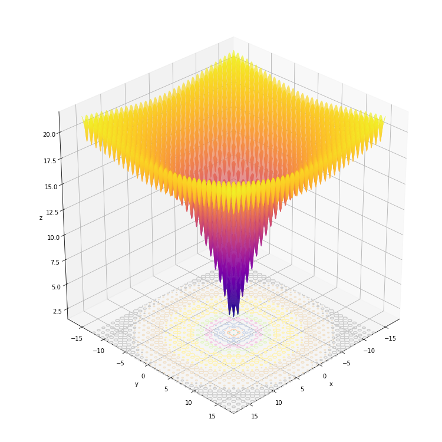
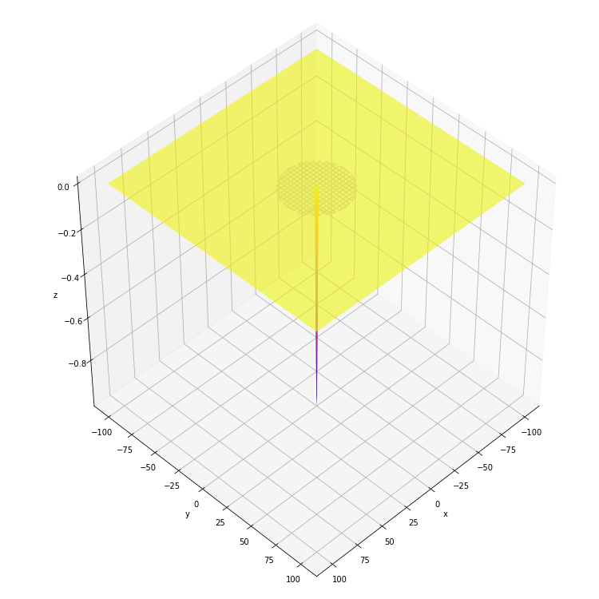
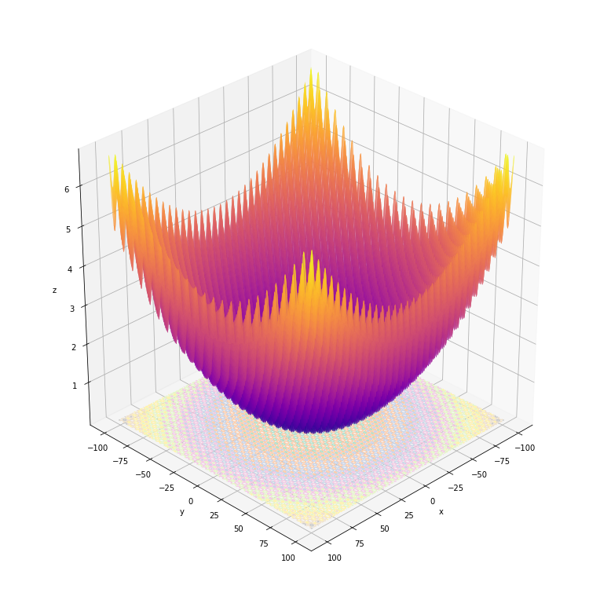
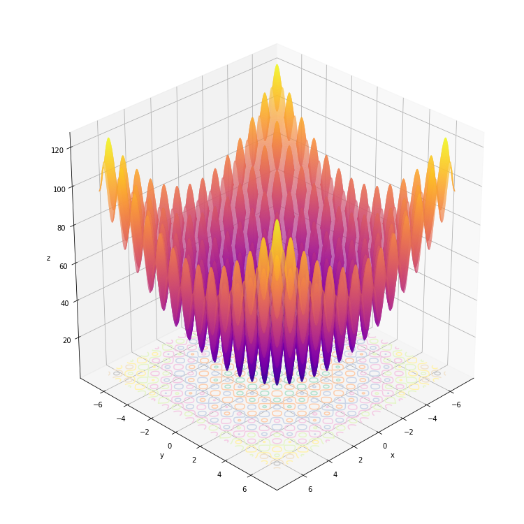
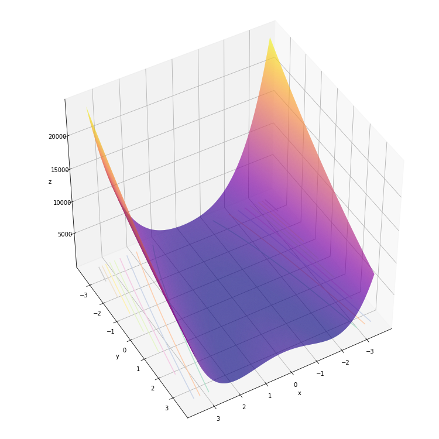
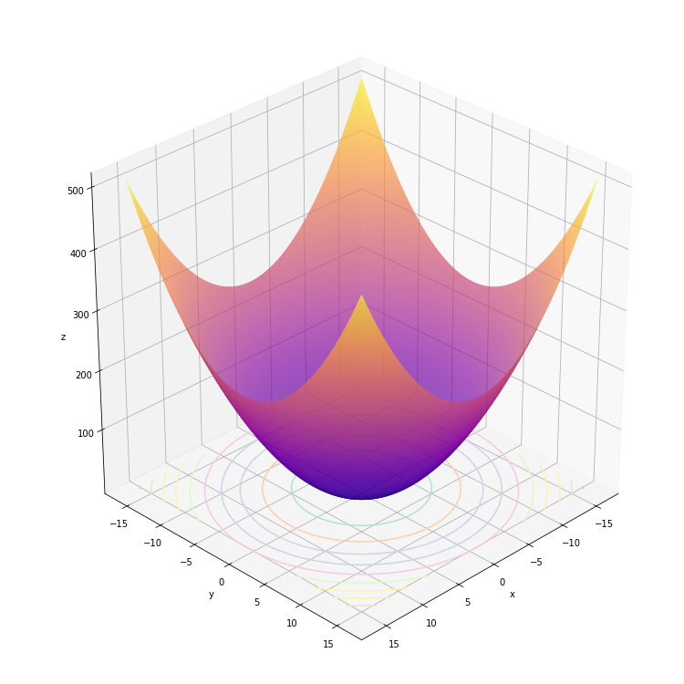
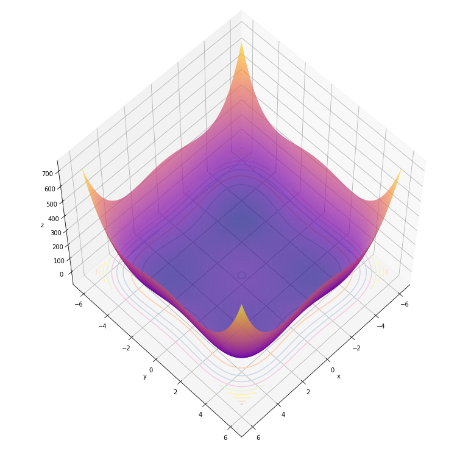

# Részecske-raj optimalizáció (PSO)

```
python pso.py
```

## Command line arguments

`-h` - súgó

`--iteration` - ciklusszám

`--population` - részecskék száma

`--function` - függvény neve a lehetséges függvények közül

`-p` - grafikus megjelenítés: 10 képet nyomtat a folyamatról a kiválasztott függvény nevű mappába

## Választható függvények

### Ackley függvény `ackley`

Globális optimum: `f(0, 0) = 0`



### Easom függvény `easom`

Globális optimum: `f(pi, pi) = -1`



### Griewank függvény `griewank`

Globális optimum: `f(0, 0) = 0`



### Rastrigin függvény `rastrigin`

Globális optimum: `f(0, 0) = 0`



### Rosenbrock függvény `rosenbrock`

Globális optimum: `f(1, 1) = 0`



### Szférikus függvény `sphere`

Globális optimum: `f(0, 0) = 0`



### Styblinksi függvény `styblinski`

Globális optimum: `f(-2.903534, -2.903534) = -78.332`



## Követelmények

Python 3.8

NumPy

matplotlib

OS: Linux
